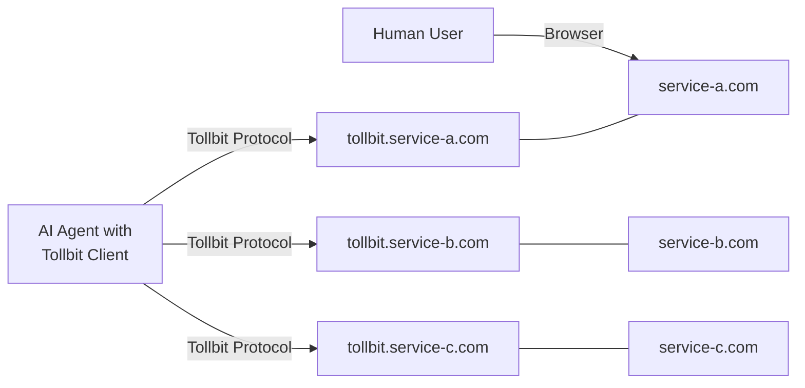
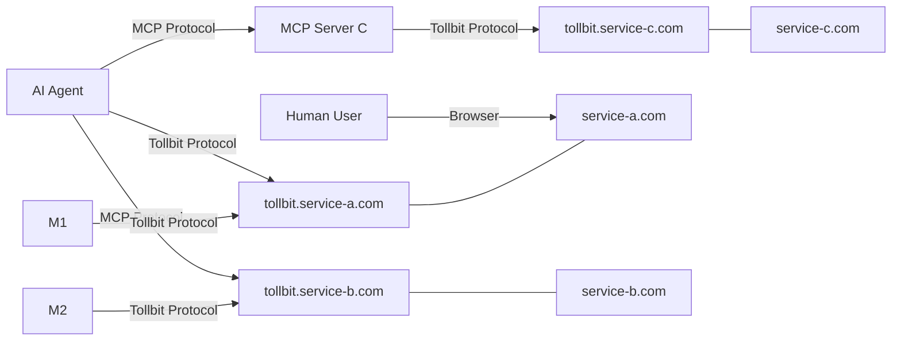

<p align="center">
  
</p>

<h3 align="center">Front Door Access for AI Agents</h2>

<br>

[](https://github.com/tollbit/tollbit/stargazers)
[](https://discord.gg/tollbit)
[](https://docs.tollbit.io)
[](https://twitter.com/tollbit)

## Tollbit

A lightweight access layer for any web application, specifically meant for AI agents. Direct, authorized, and reliable agent <-> service interactions for any web service on the internet.

## Why Tollbit Exists

It's no secret that AI agents are going to run the web in the near future. However, for that to become a reality, the way agents interact with the internet needs to change. Currently, agent builders' options are limited to typical developer APIs and/or web automation. While great for demos, these patterns seem like the initial "hack" waiting for a more long term solution.

Developer APIs work well, but there is a very short list beyond the overused Google Drive, Slack, etc. Web automation is extremely slow, unreliable and insecure. Not only that, but most websites don't want bots on them, leading to doing all the grunt work of solving captchas and avoiding getting blocked.

The main reason for all this trouble? The web was not built for agents to be first class citzens.

Tollbit aims to build critical infrastructure that opens up new pathways for agents to act on the web, at native speed, and to actually bring real value to their users.

We are building on one ethical principle: **agents shouldn't (need to) pretend to be humans on the internet**.

This approach solves problems for both sides: website owners gain a reliable way to identify legitimate AI agents, manage their access privileges, and monetize their usage, while AI developers get stable, authorized access to first-party APIs, content, or web UI.

## How Tollbit Works

Tollbit creates a gateway for AI agents through a simple convention:

**Any service with a `tollbit` subdomain (`tollbit.example.com`) explicitly welcomes agent access with standardized authorization, permissions, and monetization.**

We call this subdomain the "front door" - a dedicated entry point built specifically for AI agents, separate from human traffic.



## Tollbit Among the Ecosystem

Tollbit is intentionally built to improve, not compete with the existing ecosystem. Tollbit as the closest layer to the web service, while other frameworks specify how agents interact and communicate with that layer.

- **Model Context Protocol (MCP)**: All Tollbit services are MCP-compatible, making them plug-and-play with Anthropic's models. Tollbit is the "what", and MCP is the "how" for agents making requests on the web.
- **OpenAPI**: Works alongside API specifications while adding agent-specific authentication and monetization
- **AI Agent Frameworks**: Provides a consistent target for agent tools regardless of underlying architecture




## For Service Providers

Tollbit lets you monetize AI agent access to your service without building custom infrastructure:

- Implement once, work with any Tollbit-compatible agent
- Set different pricing tiers and usage limits
- Separate human and bot traffic transparently
- Prevent abuse through standardized authentication

## For AI Developers

Tollbit gives your agents reliable access to services:

- One consistent pattern for authentication and access
- No more brittle web automation that breaks with UI changes
- Clear permissions model designed for non-human users
- Focus on building intelligence, not maintaining integration code

## Agent Builder Quickstart

### Prerequisites

- Node.js >= 14.x (for service providers)
- Python >= 3.8 (for AI developers)
- A valid Tollbit token (sign up at [tollbit.io/register](https://tollbit.io/register))

### For AI Developers

```python
# Install the Tollbit client
pip install tollbit-client

# Connect to a Tollbit service
from tollbit import Client

client = Client(token="your_tollbit_token")
result = client.access("acme.com/get_data", params={"query": "example"})
```

## Roadmap

- [] docs

## FAQ

### Is Tollbit only for commercial services?
No. The Tollbit protocol can be used for free services too. The pricing model is optional.

### How does Tollbit handle authentication for services requiring user accounts?
Tollbit includes an OAuth-compatible flow for delegating user permissions to AI agents.

### Can I use Tollbit with my existing API?
Yes. Tollbit is designed to work alongside your existing API or web interface with minimal changes.

### How does Tollbit compare to web scraping?
Unlike web scraping, Tollbit provides a stable, approved interface that won't break with UI changes and respects the service's terms.

## Join the Community

- [Discord](https://discord.gg/tollbit)
- [GitHub](https://github.com/tollbit/tollbit)
- [Documentation](https://docs.tollbit.io)

---

<p align="center">Long live the programmable web</p>
